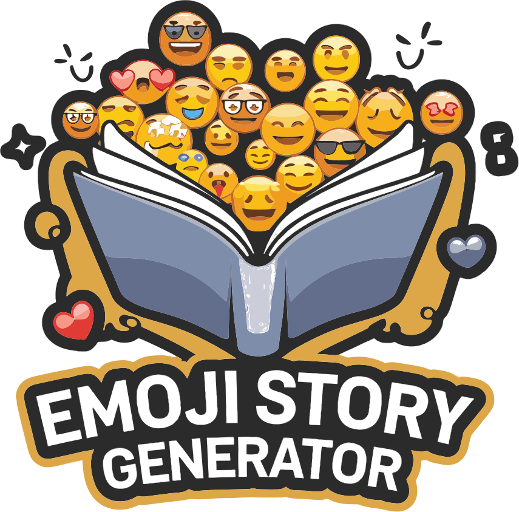

<div align="center">
 <h1><br/>Emoji Story Generator</h1>
 
 
 
</div>
<br/>

Transform your emoji selections into engaging stories with our AI-powered story generator!


https://github.com/user-attachments/assets/ecaf4494-7e51-4b86-9e79-7548957d0bcd


# Features

### 🎨 Intuitive Emoji Selection
Browse and select emojis from 8 categorized tabs including emotions, animals, food, activities and more. Simple click-to-add interface with a maximum of 5 emojis per story.

### 🤖 AI-Powered Story Generation
Leverages HuggingFace's Zephyr-7b model to create coherent, creative stories that naturally incorporate your selected emojis into the narrative.

### 📚 Story Library
All generated stories are automatically saved and can be viewed by all users. Includes a voting system to highlight the community's favorite stories.

### 💫 Smart Story Structure
Generated stories follow a clear narrative structure with:
- Beginning: Character and setting introduction
- Middle: Challenge or situation development
- End: Satisfying resolution

### 👥 Community Interaction
Like and vote on stories generated by other users, creating a collaborative creative environment.

## Tech Stack


## Getting Started

1. Clone the repository:
```bash
git clone https://github.com/ChanMeng666/emoji-story-generator
cd emoji-story-generator
```

2. Install dependencies:
```bash
pip install -r requirements.txt
```

3. Set up environment variables:
Create a `.env` file in the project root and add your HuggingFace API token:
```bash
HUGGINGFACE_API_TOKEN=your_token_here
```

4. Run the application:
```bash
streamlit run app.py
```

## Usage
1. Select up to 5 emojis from the category tabs
2. Click "Generate Story" to create your story
3. View your generated story and previous stories
4. Vote on stories you enjoy

## Contributing
Contributions are welcome! Please feel free to submit a Pull Request.

## License
This project is licensed under the MIT License - see the LICENSE file for details.
