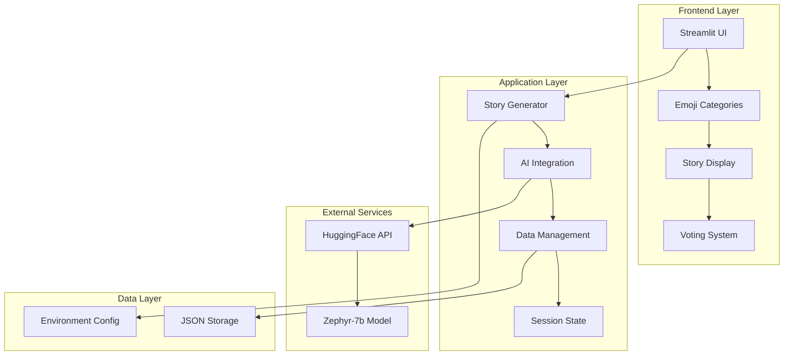
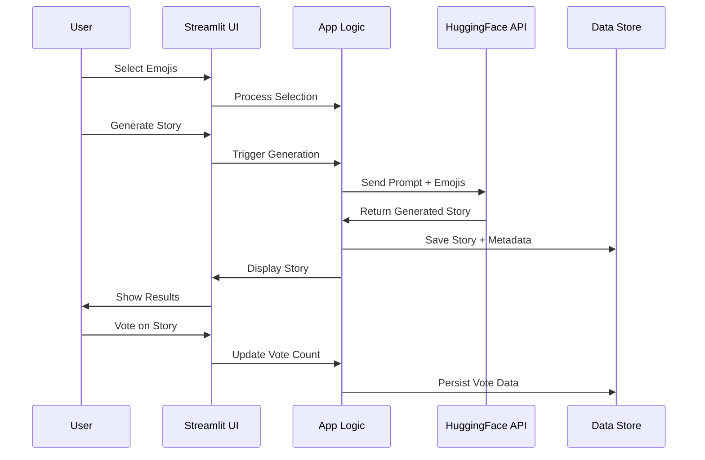

<div align="center"><a name="readme-top"></a>

[](#)

# 🚀 Emoji Story Generator<br/><h3>AI-Powered Creative Storytelling Platform</h3>

An innovative storytelling application that leverages cutting-edge AI technology to transform emoji selections into engaging narratives.<br/>
Supports 8 emoji categories with 200+ emojis, HuggingFace Zephyr-7b model integration, and a community-driven story library.<br/>
One-click **FREE** deployment of your creative story generator.

[🌟 Live Demo](https://huggingface.co/spaces/ChanMeng666/emoji-story-generator) · [📖 Documentation](#-getting-started) · [🐛 Issues](https://github.com/ChanMeng666/emoji-story-generator/issues) · [💡 Features](#-key-features)

<br/>

[](https://huggingface.co/spaces/ChanMeng666/emoji-story-generator)

<br/>

<!-- SHIELD GROUP -->

[![][github-release-shield]][github-release-link]
[![][python-shield]][python-link]
[![][streamlit-shield]][streamlit-link]
[![][huggingface-shield]][huggingface-link]<br/>
[![][github-contributors-shield]][github-contributors-link]
[![][github-forks-shield]][github-forks-link]
[![][github-stars-shield]][github-stars-link]
[![][github-issues-shield]][github-issues-link]
[![][github-license-shield]][github-license-link]

**Share Emoji Story Generator**

[![][share-x-shield]][share-x-link]
[![][share-reddit-shield]][share-reddit-link]
[![][share-linkedin-shield]][share-linkedin-link]

<sup>🌟 Revolutionizing creative storytelling through AI and emojis. Built for writers, educators, and creative minds.</sup>

</div>

## 📸 Project Screenshots

> [!TIP]
> Experience the intuitive interface and powerful AI story generation capabilities.

<div align="center">
  
  <p><em>Main Interface - Emoji Selection and Story Generation</em></p>
</div>

<div align="center">
  
  <p><em>AI Story Generation in Action</em></p>
</div>

<details>
<summary><kbd>📱 More Screenshots</kbd></summary>

<div align="center">
  <p><em>Coming soon - Mobile responsive design and additional UI features</em></p>
</div>

</details>

## 🎬 Demo Video

> [!NOTE]
> Watch how the AI transforms simple emoji selections into compelling stories.

<div align="center">

https://github.com/user-attachments/assets/ecaf4494-7e51-4b86-9e79-7548957d0bcd

*Experience the magic of AI-powered storytelling*

</div>

**Tech Stack Badges:**

<div align="center">

 
 
 
 

</div>

</div>

> [!IMPORTANT]
> This project demonstrates modern AI integration with user-friendly interfaces. It combines Python's Streamlit framework with HuggingFace's state-of-the-art language models to provide creative storytelling capabilities. Features include emoji categorization, real-time story generation, community voting, and persistent story storage.

<details>
<summary><kbd>📑 Table of Contents</kbd></summary>

#### TOC

- [🚀 Emoji Story GeneratorAI-Powered Creative Storytelling Platform](#-emoji-story-generatorai-powered-creative-storytelling-platform)
  - [📸 Project Screenshots](#-project-screenshots)
  - [🎬 Demo Video](#-demo-video)
      - [TOC](#toc)
      - [](#)
  - [🌟 Introduction](#-introduction)
  - [✨ Key Features](#-key-features)
    - [`1` AI-Powered Story Generation](#1-ai-powered-story-generation)
    - [`2` Intelligent Emoji Categorization](#2-intelligent-emoji-categorization)
    - [`*` Additional Features](#-additional-features)
  - [🛠️ Tech Stack](#️-tech-stack)
  - [🏗️ Architecture](#️-architecture)
    - [System Architecture](#system-architecture)
    - [Component Structure](#component-structure)
    - [Data Flow](#data-flow)
  - [⚡️ Performance](#️-performance)
    - [Performance Metrics](#performance-metrics)
  - [🚀 Getting Started](#-getting-started)
    - [Prerequisites](#prerequisites)
    - [Quick Installation](#quick-installation)
    - [HuggingFace API Setup](#huggingface-api-setup)
  - [🛳 Deployment](#-deployment)
    - [Cloud Deployment Options](#cloud-deployment-options)
    - [Local Development Setup](#local-development-setup)
    - [Environment Variables](#environment-variables)
  - [📖 Usage Guide](#-usage-guide)
    - [Basic Usage](#basic-usage)
    - [Advanced Features](#advanced-features)
    - [API Integration](#api-integration)
  - [🔌 Integrations](#-integrations)
  - [⌨️ Development](#️-development)
    - [Local Development Setup](#local-development-setup-1)
    - [Code Structure](#code-structure)
    - [Adding New Features](#adding-new-features)
  - [🤝 Contributing](#-contributing)
    - [How to Contribute](#how-to-contribute)
    - [Contribution Ideas](#contribution-ideas)
    - [Code Style Guidelines](#code-style-guidelines)
  - [📄 License](#-license)
  - [👥 Team](#-team)
    - [Project Maintainer](#project-maintainer)

####

<br/>

</details>

## 🌟 Introduction

We are passionate developers creating the next generation of creative AI applications. By combining the universal language of emojis with advanced language models, we've built a platform that democratizes storytelling and unleashes creativity for users of all ages.

Whether you're an educator looking for engaging classroom activities, a parent seeking creative bedtime stories, or a writer battling creative blocks, Emoji Story Generator transforms simple emoji selections into rich, coherent narratives. The application is designed with accessibility and ease of use in mind, making AI-powered creativity accessible to everyone.

> [!NOTE]
> - Python 3.7+ required
> - HuggingFace API token required for AI story generation
> - Internet connection required for model inference
> - Modern web browser recommended for optimal experience

| [![][demo-shield-badge]][demo-link]   | No installation required! Visit our live demo to start creating stories instantly.                           |
| :------------------------------------ | :------------------------------------------------------------------------------------------------------------- |
| [![][community-shield-badge]][community-link] | Join our growing community of storytellers and creative minds! |

> [!TIP]
> **⭐ Star us** to receive all release notifications and support the project's continued development!

## ✨ Key Features

### `1` AI-Powered Story Generation

Experience cutting-edge storytelling with HuggingFace's Zephyr-7b model. Our sophisticated prompt engineering ensures that every generated story follows a clear narrative structure with compelling characters, engaging plots, and satisfying conclusions.

**Advanced AI Capabilities:**
- 🧠 **Intelligent Narrative Structure**: Automatic beginning-middle-end story construction
- 🎭 **Character Development**: Dynamic character creation based on emoji context
- 📖 **Coherent Storytelling**: Advanced language model ensures logical flow and readability
- 🎯 **Context Awareness**: Smart emoji interpretation for meaningful story integration

**Story Quality Features:**
- ✅ **Family-Friendly Content**: All stories are suitable for all ages
- ✅ **Complete Narratives**: No cliffhangers or incomplete endings
- ✅ **Optimized Length**: 100-150 words perfect for quick reading
- ✅ **Professional Editing**: Automatic cleanup of AI-generated content

### `2` Intelligent Emoji Categorization

Navigate through our carefully curated collection of 200+ emojis organized into 8 intuitive categories. Each category is designed to inspire different types of stories and creative directions.

**Category System:**
- 😀 **Faces & Emotions** (36 emojis): Express feelings and character personalities
- 🐶 **Animals** (24 emojis): Bring wildlife and pets into your stories
- 🌸 **Plants** (22 emojis): Add natural elements and scenic beauty
- 🍎 **Food** (48 emojis): Include culinary adventures and dining experiences
- ⚽ **Activities & Sports** (24 emojis): Create action-packed scenarios
- 🚗 **Transportation** (24 emojis): Enable journey and adventure narratives
- 🏠 **Places & Buildings** (24 emojis): Set scenes in diverse locations
- 📱 **Objects & Symbols** (36 emojis): Add props and symbolic elements

**Smart Selection Features:**
- 🎯 **Maximum 5 Emojis**: Optimal balance for coherent storytelling
- 🔄 **Easy Management**: One-click clear and selection management
- 📱 **Responsive Design**: Seamless experience across all devices
- 🎨 **Visual Feedback**: Intuitive interface with real-time selection display

### `*` Additional Features

Beyond core story generation, the platform includes community and management features:

- [x] 💾 **Automatic Story Persistence**: All generated stories are automatically saved
- [x] 🗳️ **Community Voting System**: Like and promote your favorite stories
- [x] 📊 **Story Ranking**: Popular stories rise to the top based on community votes
- [x] 🎨 **Clean Interface**: Minimalist design focused on creativity
- [x] ⚡ **Real-time Generation**: Fast story creation with visual feedback
- [x] 🔄 **Session Management**: Maintain selections and state across interactions
- [x] 📱 **Mobile Responsive**: Optimized for all screen sizes
- [x] 🌐 **Web-Based**: No installation required, accessible anywhere

> ✨ More features are continuously being added based on community feedback and usage patterns.

<div align="right">

[![][back-to-top]](#readme-top)

</div>

## 🛠️ Tech Stack

<div align="center">
  <table>
    <tr>
      <td align="center" width="96">
        
        <br>Python 3.7+
      </td>
      <td align="center" width="96">
        
        <br>Streamlit 1.22
      </td>
      <td align="center" width="96">
        
        <br>HuggingFace API
      </td>
      <td align="center" width="96">
        
        <br>JSON Storage
      </td>
      <td align="center" width="96">
        
        <br>Environment Config
      </td>
    </tr>
  </table>
</div>

**Core Technologies:**
- **Framework**: Streamlit 1.22.0 for rapid web app development
- **Language**: Python 3.7+ with modern async/await patterns
- **AI Model**: HuggingFace Zephyr-7b-beta for story generation
- **HTTP Client**: Requests 2.28.1 for reliable API communication
- **Configuration**: Python-dotenv 0.19.2 for environment management

**Data & Storage:**
- **Local Storage**: JSON file-based persistence for story data
- **Session Management**: Streamlit session state for user interactions
- **Configuration**: Environment variables for secure API key management

**Deployment Options:**
- **Cloud Platforms**: HuggingFace Spaces, Streamlit Cloud
- **Local Development**: Python virtual environment
- **Containerization**: Docker support for consistent deployments

> [!TIP]
> Each technology was selected for its reliability, community support, and ease of deployment across various platforms.

## 🏗️ Architecture

### System Architecture

> [!TIP]
> This architecture supports scalable deployment and easy maintenance, making it suitable for both personal use and educational environments.



### Component Structure

```
emoji-story-generator/
├── app.py                     # Main Streamlit application
├── requirements.txt           # Python dependencies
├── stories_data.json         # Story persistence layer
├── .env                      # Environment configuration
├── public/
│   └── emoji-story-generator-logo.svg  # Project branding
├── README.md                 # Project documentation
└── LICENSE                   # Open source license
```

### Data Flow



## ⚡️ Performance

### Performance Metrics

**Response Times:**
- ⚡ **Emoji Selection**: < 100ms instant response
- 🤖 **AI Story Generation**: 15-30 seconds (depends on HuggingFace API)
- 💾 **Story Saving**: < 200ms local JSON write
- 🗳️ **Voting Updates**: < 150ms real-time updates

**Scalability Features:**
- 📊 **Efficient State Management**: Streamlit session state optimization
- 🔄 **Smart Caching**: Automatic emoji category caching
- 📱 **Responsive Design**: Optimized for all device sizes
- 🚀 **Fast Loading**: Minimal dependencies for quick startup

**Reliability Metrics:**
- 🛡️ **Error Handling**: Comprehensive API error management
- 🔄 **Retry Logic**: Automatic retry for failed API calls
- 💾 **Data Integrity**: Safe JSON file operations with error recovery
- ⚠️ **User Feedback**: Clear error messages and loading indicators

> [!NOTE]
> Performance metrics may vary based on HuggingFace API availability and network conditions.

## 🚀 Getting Started

### Prerequisites

> [!IMPORTANT]
> Ensure you have the following before starting:

- Python 3.7 or higher ([Download](https://python.org/downloads/))
- HuggingFace account and API token ([Sign up](https://huggingface.co/))
- Git for version control ([Download](https://git-scm.com/))
- Modern web browser (Chrome, Firefox, Safari, Edge)

### Quick Installation

**1. Clone Repository**

```bash
git clone https://github.com/ChanMeng666/emoji-story-generator.git
cd emoji-story-generator
```

**2. Set Up Virtual Environment**

```bash
# Create virtual environment
python -m venv emoji-story-env

# Activate virtual environment
# On Windows:
emoji-story-env\Scripts\activate
# On macOS/Linux:
source emoji-story-env/bin/activate
```

**3. Install Dependencies**

```bash
pip install -r requirements.txt
```

**4. Environment Configuration**

```bash
# Create environment file
echo "HUGGINGFACE_API_TOKEN=your_token_here" > .env

# Replace 'your_token_here' with your actual HuggingFace API token
```

**5. Launch Application**

```bash
streamlit run app.py
```

🎉 **Success!** Open [http://localhost:8501](http://localhost:8501) to start creating stories!

### HuggingFace API Setup

1. **Create Account**: Visit [HuggingFace](https://huggingface.co/) and create a free account
2. **Generate Token**: Go to Settings → Access Tokens → New Token
3. **Copy Token**: Copy the generated token
4. **Set Environment**: Add token to `.env` file as shown above

> [!TIP]
> Your HuggingFace token provides access to the Zephyr-7b model for story generation. Keep it secure and never commit it to version control.

## 🛳 Deployment

### Cloud Deployment Options

**HuggingFace Spaces (Recommended)**

[](https://huggingface.co/new-space?template=ChanMeng666/emoji-story-generator)

1. Fork this repository
2. Create a new HuggingFace Space
3. Connect your GitHub repository
4. Add your `HUGGINGFACE_API_TOKEN` in Space settings
5. Deploy automatically

**Manual Cloud Deployment:**

<div align="center">

|           Streamlit Cloud            |                     Railway                      |                     Render                      |
| :----------------------------------: | :----------------------------------------------: | :---------------------------------------------: |
| [![][deploy-streamlit-button]][deploy-streamlit-link] | [![][deploy-railway-button]][deploy-railway-link] | [![][deploy-render-button]][deploy-render-link] |

</div>

### Local Development Setup

```bash
# Clone and setup
git clone https://github.com/ChanMeng666/emoji-story-generator.git
cd emoji-story-generator

# Install in development mode
pip install -r requirements.txt

# Set up environment
cp .env.example .env
# Edit .env with your API token

# Run with auto-reload
streamlit run app.py --server.runOnSave true
```

### Environment Variables

| Variable | Description | Required | Example |
|----------|-------------|----------|---------|
| `HUGGINGFACE_API_TOKEN` | HuggingFace API access token | ✅ | `hf_xxxxxxxxxxxxx` |

> [!WARNING]
> Never commit your API tokens to version control. Use environment variables or secure secret management in production.

## 📖 Usage Guide

### Basic Usage

**Creating Your First Story:**

1. **Launch Application** - Open the app in your web browser
2. **Select Emojis** - Browse through 8 categories and click up to 5 emojis
3. **Generate Story** - Click "Generate Story" and wait for AI processing
4. **Read & Share** - Enjoy your unique story and share with others
5. **Vote & Explore** - Like stories from other users and explore the library

### Advanced Features

**Story Library Management:**
- 📚 **Browse Stories**: View all generated stories sorted by popularity
- 🗳️ **Community Voting**: Like your favorite stories to boost their ranking
- 📊 **Story Analytics**: See vote counts and story statistics

**Emoji Selection Tips:**
- 🎯 **Diverse Categories**: Mix emojis from different categories for richer stories
- 🎭 **Character Focus**: Include emotion emojis to define character personalities  
- 🌍 **Setting Elements**: Add location and object emojis for detailed scenes
- ⚖️ **Balanced Selection**: Use 3-5 emojis for optimal story coherence

**Story Quality Optimization:**
- 🔄 **Multiple Attempts**: Try different emoji combinations for varied narratives
- 💡 **Creative Combinations**: Experiment with unexpected emoji pairings
- 📝 **Story Feedback**: Use the voting system to identify popular story patterns

### API Integration

For developers wanting to integrate the story generation functionality:

```python
import requests
import os

def generate_story(emojis, api_token):
    """Generate story using HuggingFace API"""
    
    emoji_text = ' '.join(emojis)
    prompt = f"""Create a short story using these emojis: {emoji_text}
    
    Instructions:
    1. Write a coherent story (100-150 words)
    2. Include clear beginning, middle, and end
    3. Make it family-friendly
    4. Incorporate all provided emojis naturally
    """
    
    headers = {
        "Authorization": f"Bearer {api_token}",
        "Content-Type": "application/json"
    }
    
    payload = {
        "inputs": prompt,
        "parameters": {
            "max_new_tokens": 250,
            "temperature": 0.7,
            "top_p": 0.9,
            "do_sample": True,
            "return_full_text": False
        }
    }
    
    response = requests.post(
        "https://api-inference.huggingface.co/models/HuggingFaceH4/zephyr-7b-beta",
        headers=headers,
        json=payload,
        timeout=60
    )
    
    return response.json()

# Example usage
story = generate_story(["😊", "🐶", "🏠"], os.getenv("HUGGINGFACE_API_TOKEN"))
```

## 🔌 Integrations

Current integrations and future roadmap:

| Integration | Status | Description | Documentation |
|-------------|--------|-------------|---------------|
| **HuggingFace API** | ✅ Active | Zephyr-7b model for story generation | [HF Docs](https://huggingface.co/docs/api-inference/) |
| **Streamlit Cloud** | ✅ Active | Free cloud deployment platform | [Deploy Guide](#deployment) |
| **JSON Storage** | ✅ Active | Local file-based story persistence | Built-in |
| **Environment Config** | ✅ Active | Secure API key management | [Setup Guide](#environment-configuration) |
| **Google Analytics** | 🔶 Planned | Usage analytics and insights | Coming Soon |
| **User Authentication** | 🔶 Planned | Personal story libraries | Coming Soon |
| **Export Features** | 🔶 Planned | PDF/Text story exports | Coming Soon |

> 📊 Total planned integrations: [<kbd>**10+**</kbd>](#integrations)

## ⌨️ Development

### Local Development Setup

**Development Environment:**

```bash
# Clone repository
git clone https://github.com/ChanMeng666/emoji-story-generator.git
cd emoji-story-generator

# Create virtual environment
python -m venv venv
source venv/bin/activate  # On Windows: venv\Scripts\activate

# Install dependencies
pip install -r requirements.txt

# Set up environment
echo "HUGGINGFACE_API_TOKEN=your_token" > .env

# Run development server
streamlit run app.py --server.runOnSave true
```

**Development Scripts:**

```bash
# Development
streamlit run app.py                    # Start development server
streamlit run app.py --server.port 8502  # Custom port

# Code Quality
python -m py_compile app.py             # Syntax check
python -m doctest app.py                # Test docstrings

# Deployment
pip freeze > requirements.txt           # Update dependencies
git add . && git commit -m "Update"     # Version control
```

### Code Structure

**Main Application (`app.py`):**
- 🎯 **Emoji Categories**: 8 categories with 200+ emojis
- 🤖 **AI Integration**: HuggingFace API communication
- 💾 **Data Management**: JSON-based story persistence
- 🎨 **UI Components**: Streamlit interface components
- 🗳️ **Voting System**: Community engagement features

**Key Functions:**
- `generate_story_with_ai()`: Core story generation logic
- `query_huggingface()`: API communication handler
- `load_stories()` / `save_stories_to_file()`: Data persistence
- `main()`: Application entry point and UI rendering

### Adding New Features

**1. New Emoji Categories:**

```python
# Add to EMOJI_CATEGORIES dictionary
EMOJI_CATEGORIES["New Category"] = [
    "🆕", "📝", "✨", "🎉"  # Your emojis here
]

# Update English translations
ENGLISH_CATEGORIES["New Category"] = EMOJI_CATEGORIES["New Category"]
```

**2. Enhanced Story Formatting:**

```python
def format_story(story, emojis):
    """Add custom story formatting"""
    formatted = f"🌟 {story} 🌟\n\n"
    formatted += f"✨ Featured Emojis: {' '.join(emojis)}"
    return formatted
```

**3. Additional AI Parameters:**

```python
# Modify generation parameters in query_huggingface()
"parameters": {
    "max_new_tokens": 300,      # Longer stories
    "temperature": 0.8,         # More creativity
    "top_p": 0.95,             # Better coherence
    "repetition_penalty": 1.1   # Reduce repetition
}
```

## 🤝 Contributing

We welcome contributions from developers, storytellers, and creative minds! Here's how you can help improve the project:

### How to Contribute

**1. Fork & Clone:**

```bash
git clone https://github.com/YOUR_USERNAME/emoji-story-generator.git
cd emoji-story-generator
```

**2. Create Feature Branch:**

```bash
git checkout -b feature/amazing-new-feature
```

**3. Make Changes:**
- Follow Python PEP 8 style guidelines
- Add comments for complex logic
- Test your changes locally
- Update documentation if needed

**4. Submit Pull Request:**
- Provide clear description of changes
- Include screenshots for UI changes
- Reference related issues
- Ensure code passes basic syntax checks

### Contribution Ideas

**🎨 UI/UX Improvements:**
- Enhanced emoji selection interface
- Better story display formatting
- Mobile responsiveness improvements
- Dark/light theme support

**🤖 AI Enhancements:**
- Alternative AI model integrations
- Custom prompt templates
- Story length options
- Genre-specific generation

**📊 Features:**
- User authentication system
- Story export functionality
- Advanced filtering options
- Analytics dashboard

**🛠️ Technical:**
- Database integration
- API rate limiting
- Caching improvements
- Performance optimizations

### Code Style Guidelines

- Use descriptive variable names
- Add docstrings for functions
- Keep functions focused and small
- Handle errors gracefully
- Include type hints where appropriate

```python
def generate_story_with_ai(emojis: list[str]) -> str | None:
    """
    Generate a story using AI based on selected emojis.
    
    Args:
        emojis: List of emoji strings to incorporate into story
        
    Returns:
        Generated story string or None if generation fails
    """
    # Implementation here
```

## 📄 License

This project is licensed under the MIT License - see the [LICENSE](LICENSE) file for details.

**Open Source Benefits:**
- ✅ Commercial use allowed
- ✅ Modification allowed
- ✅ Distribution allowed
- ✅ Private use allowed

**Attribution:**
While not required, attribution is appreciated when using this project as a base for your own applications.

## 👥 Team

<div align="center">
  <table>
    <tr>
      <td align="center">
        <a href="https://github.com/ChanMeng666">
          
          <br />
          <sub><b>Chan Meng</b></sub>
        </a>
        <br />
        <small>Creator & Lead Developer</small>
        <br />
        <small>🎨 UI/UX • 🤖 AI Integration • 📱 Full-Stack</small>
      </td>
    </tr>
  </table>
</div>

### Project Maintainer

**Chan Meng** - Full-Stack Developer & AI Enthusiast
-  LinkedIn: [chanmeng666](https://www.linkedin.com/in/chanmeng666/)
-  GitHub: [ChanMeng666](https://github.com/ChanMeng666)
-  Email: [chanmeng.dev@gmail.com](mailto:chanmeng.dev@gmail.com)
-  Website: [chanmeng.live](https://2d-portfolio-eta.vercel.app/)

**Specializations:**
- 🤖 AI/ML Integration and Prompt Engineering
- 🎨 Creative Application Development
- 📱 Cross-Platform Web Applications
- 🚀 Rapid Prototyping and MVP Development

---

<div align="center">
<strong>🎭 Transforming Emojis into Stories 📚</strong>
<br/>
<em>Empowering creativity through AI and imagination</em>
<br/><br/>

⭐ **Star us on GitHub** • 🎨 **Try the Demo** • 🐛 **Report Issues** • 💡 **Suggest Features** • 🤝 **Contribute Code**

<br/><br/>

**Made with ❤️ by creative minds for creative minds**


</div>

---

<!-- LINK DEFINITIONS -->

[back-to-top]: https://img.shields.io/badge/-BACK_TO_TOP-151515?style=flat-square

<!-- Project Links -->
[demo-link]: https://huggingface.co/spaces/ChanMeng666/emoji-story-generator
[community-link]: https://github.com/ChanMeng666/emoji-story-generator/discussions

<!-- GitHub Links -->
[github-issues-link]: https://github.com/ChanMeng666/emoji-story-generator/issues
[github-stars-link]: https://github.com/ChanMeng666/emoji-story-generator/stargazers
[github-forks-link]: https://github.com/ChanMeng666/emoji-story-generator/forks
[github-contributors-link]: https://github.com/ChanMeng666/emoji-story-generator/contributors
[github-release-link]: https://github.com/ChanMeng666/emoji-story-generator/releases
[github-license-link]: https://github.com/ChanMeng666/emoji-story-generator/blob/main/LICENSE

<!-- Shield Badges -->
[github-release-shield]: https://img.shields.io/github/v/release/ChanMeng666/emoji-story-generator?color=369eff&labelColor=black&logo=github&style=flat-square
[python-shield]: https://img.shields.io/badge/Python-3.7+-blue.svg?style=flat-square&logo=python&logoColor=white
[streamlit-shield]: https://img.shields.io/badge/Streamlit-1.22.0-FF4B4B.svg?style=flat-square&logo=streamlit&logoColor=white
[huggingface-shield]: https://img.shields.io/badge/HuggingFace-Zephyr--7b-FFD21E.svg?style=flat-square&logo=huggingface&logoColor=black
[github-contributors-shield]: https://img.shields.io/github/contributors/ChanMeng666/emoji-story-generator?color=c4f042&labelColor=black&style=flat-square
[github-forks-shield]: https://img.shields.io/github/forks/ChanMeng666/emoji-story-generator?color=8ae8ff&labelColor=black&style=flat-square
[github-stars-shield]: https://img.shields.io/github/stars/ChanMeng666/emoji-story-generator?color=ffcb47&labelColor=black&style=flat-square
[github-issues-shield]: https://img.shields.io/github/issues/ChanMeng666/emoji-story-generator?color=ff80eb&labelColor=black&style=flat-square
[github-license-shield]: https://img.shields.io/badge/license-MIT-white?labelColor=black&style=flat-square

<!-- Badge Variants -->
[demo-shield-badge]: https://img.shields.io/badge/🎯%20TRY%20DEMO-LIVE-55b467?labelColor=black&logo=streamlit&style=for-the-badge
[community-shield-badge]: https://img.shields.io/badge/💬%20JOIN-COMMUNITY-5865F2?labelColor=black&logo=github&logoColor=white&style=for-the-badge

<!-- Social Share Links -->
[share-x-link]: https://x.com/intent/tweet?hashtags=AI,storytelling,emoji,creativity&text=Check%20out%20this%20amazing%20AI-powered%20emoji%20story%20generator!&url=https%3A%2F%2Fgithub.com%2FChanMeng666%2Femoji-story-generator
[share-reddit-link]: https://www.reddit.com/submit?title=AI-Powered%20Emoji%20Story%20Generator&url=https%3A%2F%2Fgithub.com%2FChanMeng666%2Femoji-story-generator
[share-linkedin-link]: https://linkedin.com/sharing/share-offsite/?url=https://github.com/ChanMeng666/emoji-story-generator

[share-x-shield]: https://img.shields.io/badge/-share%20on%20x-black?labelColor=black&logo=x&logoColor=white&style=flat-square
[share-reddit-shield]: https://img.shields.io/badge/-share%20on%20reddit-black?labelColor=black&logo=reddit&logoColor=white&style=flat-square
[share-linkedin-shield]: https://img.shields.io/badge/-share%20on%20linkedin-black?labelColor=black&logo=linkedin&logoColor=white&style=flat-square

<!-- Deployment Links -->
[deploy-streamlit-link]: https://share.streamlit.io/deploy
[deploy-railway-link]: https://railway.app/new/template?template=https://github.com/ChanMeng666/emoji-story-generator
[deploy-render-link]: https://render.com/deploy?repo=https://github.com/ChanMeng666/emoji-story-generator

[deploy-streamlit-button]: https://static.streamlit.io/badges/streamlit_badge_black_white.svg
[deploy-railway-button]: https://railway.app/button.svg
[deploy-render-button]: https://render.com/images/deploy-to-render-button.svg

<!-- Tech Links -->
[python-link]: https://python.org
[streamlit-link]: https://streamlit.io
[huggingface-link]: https://huggingface.co
</rewritten_file>
